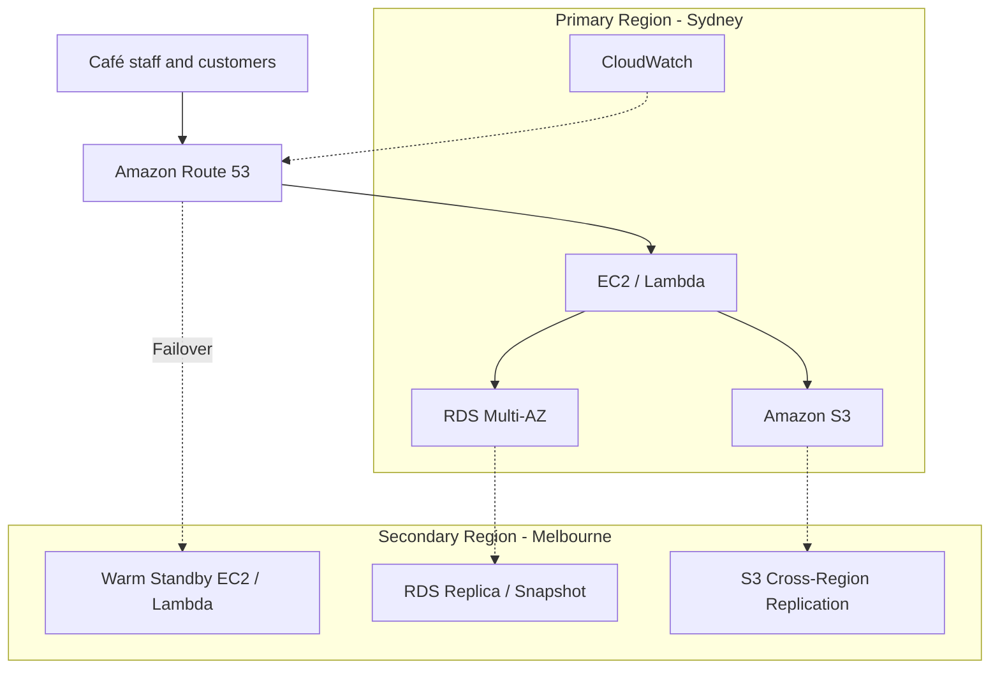

# AWS Disaster Recovery Architecture

The following diagram illustrates the proposed multi-region Warm Standby architecture for the café business.

```mermaid
flowchart TB
    Users["Café staff and customers"]
    DNS["Amazon Route 53"]

    subgraph Sydney["Primary Region - Sydney"]
        APP["EC2 / Lambda"]
        DB["RDS Multi-AZ"]
        S3["Amazon S3"]
        CW["CloudWatch"]
    end

    subgraph Melbourne["Secondary Region - Melbourne"]
        APP2["Warm Standby EC2 / Lambda"]
        DB2["RDS Replica / Snapshot"]
        S32["S3 Cross-Region Replication"]
    end

    Users --> DNS
    DNS --> APP
    APP --> DB
    APP --> S3
    S3 -.-> S32
    DB -.-> DB2
    CW -.-> DNS
    DNS -. Failover .-> APP2
```
